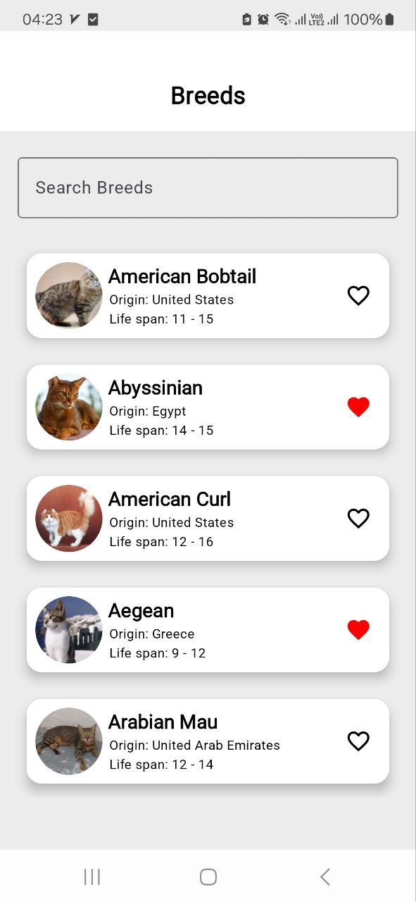
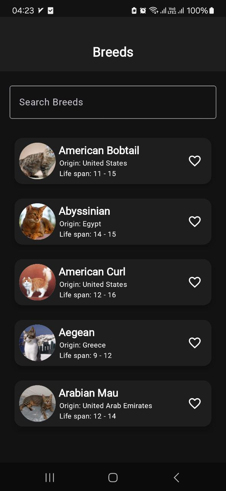
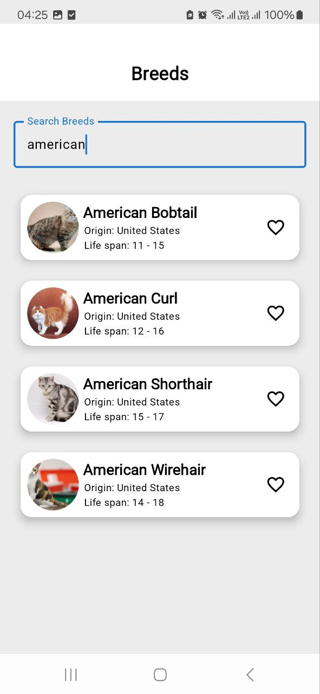
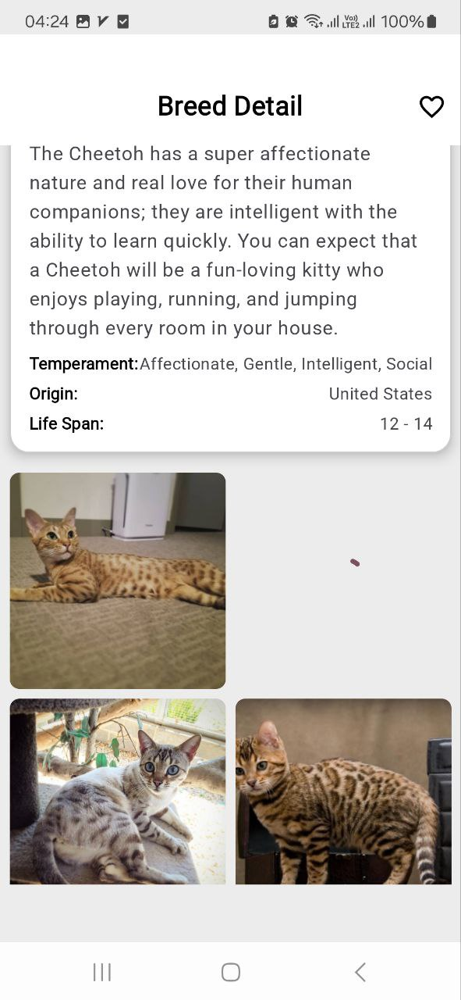
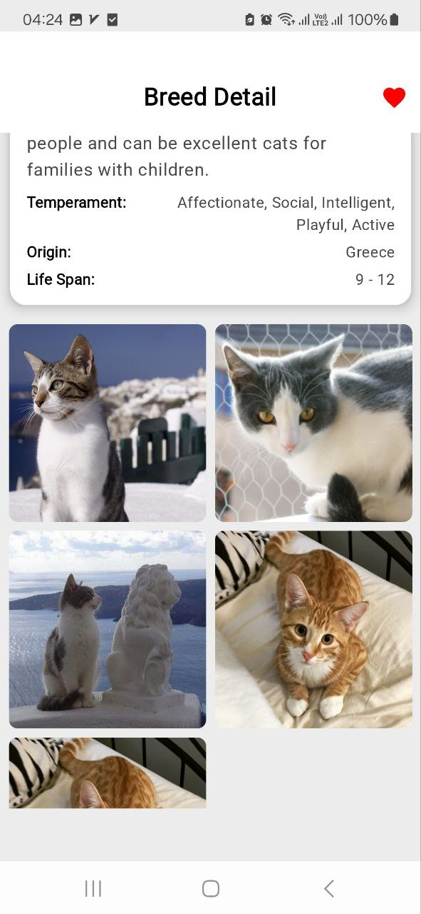

# Project Title
**Breed Explorer**

## Overview
Breed Explorer is a robust Android application designed to allow users to explore detailed information about dog breeds. The app provides a seamless experience for browsing a paginated list of breeds, marking breeds as favorites, searching for specific breeds, and viewing detailed breed information with associated images displayed in a grid layout. Built with modern Android development practices, the app adheres to Clean Architecture and MVVM patterns to ensure a scalable, maintainable, and testable codebase. The project leverages a variety of libraries and tools to deliver a high-quality user experience.

## Screenshots

### Breed Explorer Screenshots

  
  
  
  
  

## Tech Stack
The application is built using the following technologies and libraries:
- **Compose**: Utilized for building a modern, reactive, and declarative user interface.
- **Navigation Component**: Manages in-app navigation, ensuring smooth transitions between screens.
- **Retrofit**: Handles network requests and API communication for fetching remote data.
- **Coil**: Used for efficient image loading and caching to optimize performance.
- **MVVM Architecture**: Implements the Model-View-ViewModel pattern to separate concerns and facilitate testing.
- **Clean Architecture**: Ensures a modular and maintainable codebase by dividing responsibilities into distinct layers.
- **Hilt**: Provides dependency injection to manage dependencies across the app.
- **Flow**: Enables reactive data streams for handling asynchronous operations.
- **Room Database**: Facilitates local data persistence for offline functionality.
- **Paging 3**: Supports efficient paginated data loading for large datasets.

## Project Structure
The project is organized into four main packages: `feature`, `core`, `app`, and `build-logic`. Each package serves a specific purpose to maintain modularity and clarity.

### 1. Build-Logic
The `build-logic` module is responsible for coordinating and standardizing the build configuration across all modules. It ensures consistency in dependencies, build scripts, and configurations, streamlining the development and build process.

### 2. Core
The `core` package is the backbone of the application, containing essential modules that provide shared functionality across features. It includes the following sub-modules:
- **Data**: 
  - Contains repositories and remote mediators.
  - Implements repository interfaces to create a layer of abstraction, ensuring loose coupling and independence between layers.
- **Domain**: 
  - Houses use cases that encapsulate the business logic of the application, making it easier to manage and test core functionalities.
- **Network**: 
  - Manages remote data sources, including the implementation of Retrofit for making API calls to fetch breed data and images.
- **Design System**: 
  - Defines the app’s theme, including colors, typography, and reusable UI components such as `Loading` (for displaying loading states) and `BreedRow` (for rendering individual breed items in lists).
- **Database**: 
  - Provides all database-related functionality, implemented using Room for efficient local data storage and retrieval.
- **Model**: 
  - Contains the app’s entities, which represent the data models used across the application.

### 3. Feature
The `feature` package currently includes a single feature module:
- **Home**: Focused on displaying a paginated list of dog breeds, allowing users to browse and interact with breed information.

### 4. App
The `app` module serves as the entry point of the application, integrating all feature and core modules to create a cohesive application.

## Implementation Details
The application implements several key functionalities to deliver a robust and user-friendly experience. Below are the details of the main features and their implementations:

### Data Management
The app uses a combination of local and remote data sources to manage breed information, favorites, and images. The following tables and mechanisms are used:
- **Favorites Table**:
  - A dedicated table stores the IDs of breeds marked as favorites by the user.
  - To display the favorite status alongside each breed, the main query for fetching breeds performs a `JOIN` operation with the favorites table to include the `isFavorite` boolean field.
- **Image Cache Table**:
  - A separate table stores image URLs and their corresponding breed IDs to enable efficient caching.
  - When fetching breeds, the query joins with the images table to check if an image reference exists for a given breed. If no image is found, a `null` value is returned, triggering an API call to fetch the image in subsequent steps.
- **Breed Table**:
  - A table stores breed data, designed to support paginated retrieval using the Paging 3 library.
  - A `RemoteMediator` ensures synchronization between the API and the local database, handling data consistency and updates.

The result of these operations is a complete `Breed` object that includes the breed’s details, its associated image URL, and its `isFavorite` status, which is then passed to the ViewModel for UI rendering.

### Search Functionality
The search feature is designed to provide a seamless experience for finding specific breeds:
- **Search Process**:
  - Search queries are initially executed via the API to fetch relevant results.
  - The results are cached in the local database for offline access.
  - If an API error occurs, the app falls back to retrieving data directly from the local database.
- **Data Enrichment**:
  - Search results are combined with data from the favorites and images tables using `JOIN` operations to include favorite status and image URLs.
- **Outcome**:
  - Users receive a fully enriched dataset that includes breed details, images, and favorite status, ensuring a consistent experience whether online or offline.

### Breed Detail Page
The breed detail page provides an in-depth view of a selected breed, including a grid of related images:
- **Breed Detail Images Table**:
  - A dedicated table stores images associated with each breed.
  - A `RemoteMediator` manages synchronization between remote API data and the local database.
  - Images are retrieved in a paginated manner and displayed in a grid layout for an engaging user experience.
- **Data Transfer**:
  - Breed information is passed from the previous screen (e.g., the home screen) to the detail screen using a shared ViewModel, ensuring efficient data sharing without redundant API calls.

### Image Loading
To optimize performance, images for a new page of breeds are loaded concurrently:
- The app uses `async` and `awaitAll` to fetch multiple images simultaneously, reducing load times and improving the user experience.

### Error Handling
- A sealed class named `Resource` is used to manage different states of data operations (e.g., `Success`, `Error`, `Loading`).
- This approach ensures robust error handling and provides clear feedback to the user during network or database operations.

### Theme Management
- The app supports comprehensive theme customization, including light and dark modes.
- Theme settings, such as colors and typography, are defined in the `Design System` module, allowing for consistent styling across the app.
- Users can switch between themes seamlessly, with all configurations handled centrally.

## Screenshots
### Home Screen (Light Mode)
Displays a paginated list of dog breeds with favorite status and images in light theme.

### Home Screen (Dark Mode)
Displays a paginated list of dog breeds with favorite status and images in dark theme.

### Breed Search
Allows users to search for breeds with results enriched with favorite status.

### Breed Detail (Loading State)
Shows the loading state while fetching detailed breed information and images.

### Breed Detail (Scrolled)
Displays detailed breed information with a grid of images after scrolling.

## Contact
For questions, feedback, or support, please reach out to the project maintainers at AmirHossein.kamranpor@gmail.com